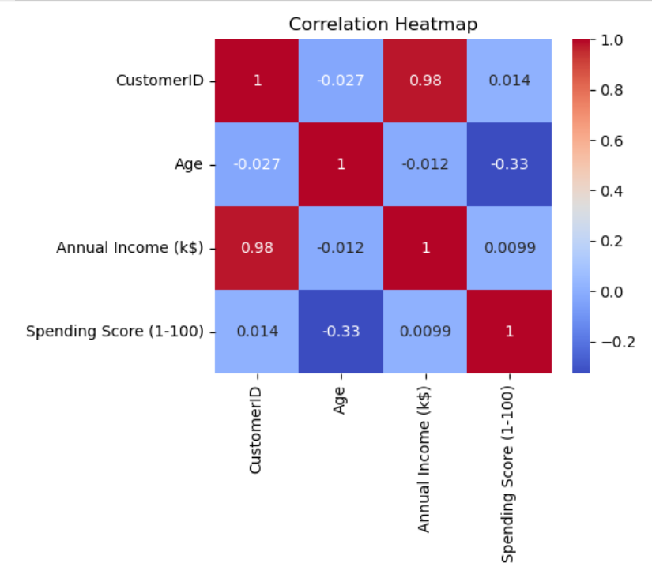
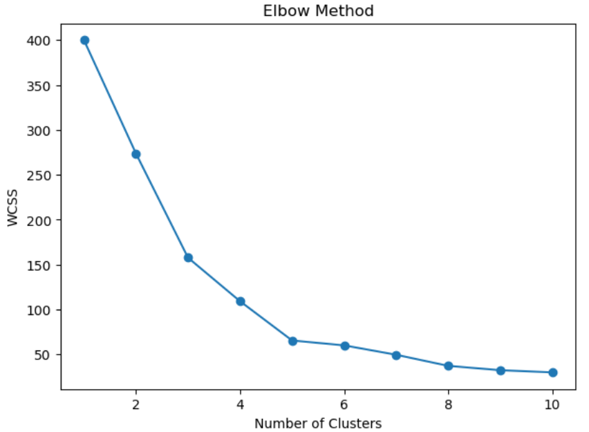
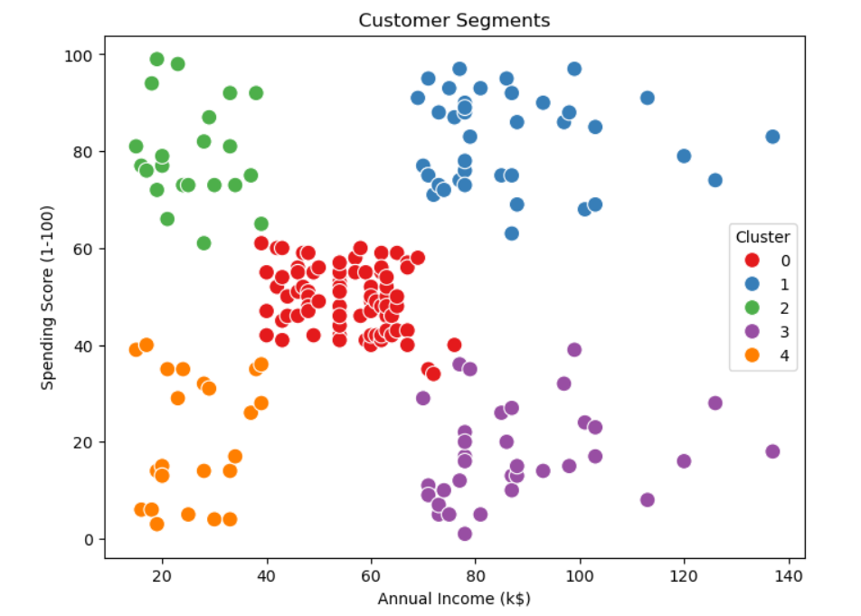
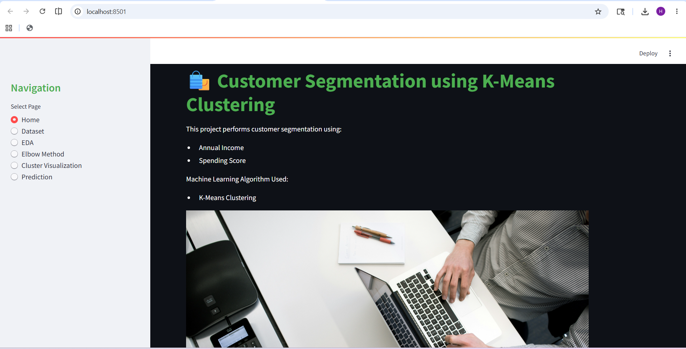
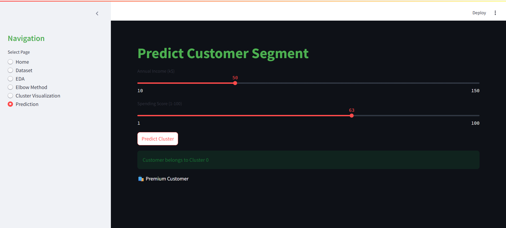

# 🛍️ Customer Segmentation using K-Means Clustering

## 📌 Overview
This project performs customer segmentation using **K-Means Clustering** to group mall customers based on:
- Annual Income
- Spending Score

The goal is to help businesses understand customer behavior and improve marketing strategies.

---

## ⚙️ Tech Stack
- Python
- Pandas, NumPy
- Matplotlib, Seaborn
- Scikit-learn
- Streamlit

---

## 📂 Dataset
**Mall Customer Dataset**

Features used:
- Annual Income (k$)
- Spending Score (1–100)

## 🔄 ML Pipeline
1. Data Loading
2. Data Cleaning
3. EDA (Exploratory Data Analysis)
4. Feature Scaling
5. Elbow Method
6. K-Means Clustering
7. Cluster Visualization
8. Streamlit Deployment

## 📊 Key Visualizations
- Correlation Heatmap
- Elbow Method Graph
- Customer Clusters Plot

## 🎯 Customer Segments
- High Income – High Spending
- High Income – Low Spending
- Low Income – High Spending
- Low Income – Low Spending
- 
## 💻 Streamlit App Features
- Dataset Preview
- EDA Visualizations
- Elbow Method Graph
- Customer Segmentation Plot
- Interactive Prediction Tool

## 📸 Project Screenshots

### Correlation Heatmap

### Elbow Method

### Customer Segmentation

### Streamlit Home Page

### Streamlit Prediction Page

## ▶️ Run Project
Click on this link OR open it manually in browser:
http://localhost:8501
This will launch the Streamlit web app.

